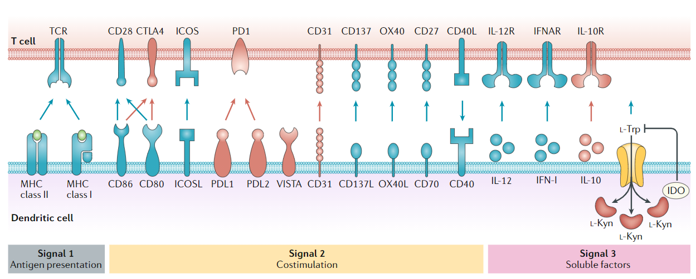
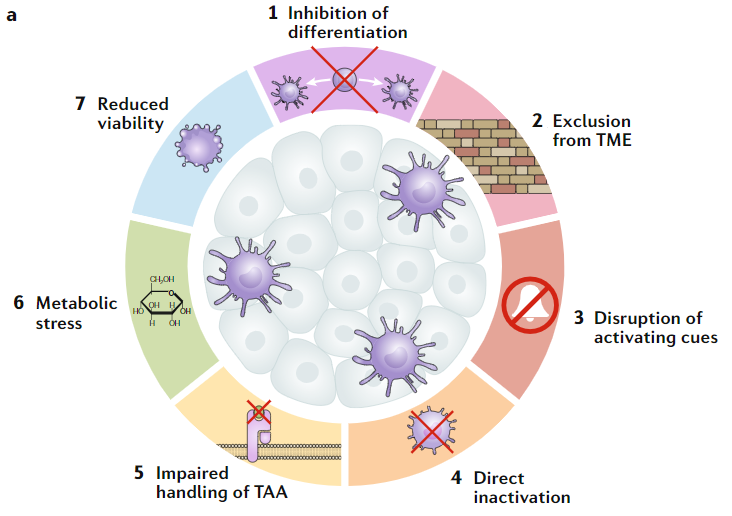

# Dendritic cells

## Diversity of DC subsets

- In mouse  
  <kbd>CDP</kbd> -> cDC1[Cd8a/Cd103(Itgae)] / cDC2[Cd11b(Itgam)]  
  <kbd>CDP</kbd>+<kbd>Lympoid progenitor</kbd> -> pDC  
  <kbd>Monocyte</kbd> -CCR2-> MoDC

- In human  
  - pDC
    - Presence in vivo  
    lymphoid tissue,blood,tonsil
    - Development  
    HSC,CDP
    - TF
    FLT3L/E2-2/IRF7
    - Surface marker
    IL3RA(CD123),CLEC4C(CD303),CCR2,CXCR3
    - PRR
    TLR7/9,RLR,STING,CLEC12A
    - function  
    Type I/II interferon secretion upon acute/chronic viral infection;  
    Cross-presenetation,can be stimulated to activate CD8 T;  
    Correlate with poor prognosis in cancer;
  - cDC1
    - Presence in vivo  
    lymphoid tissue,blood;Migratory subsets: peripheral tissue,LN  
    - Development  
    HSC,CDP,pre-cDC
    - TF  
    FLT3L,CSF2(GM-CSF),BATF3,IRF8,BCL6,ID2,ZBTB46,NFIL3,Notch signalling
    - Surface marker  
    THBD(CD141),XCR1,CLEC9A,LY75(DEC205)
    - PRR  
    TLR1/3/6/8/10,STRING,CLEC12A
    - Function  
    Cellular immunity against tumor;  
    Cross-presenetation,CD8 T,TH1 immunity;  
    Type I/III interferons;
    Correlate with beneficial prognosis
  - cDC2
    - Presence in vivo  
    lymphoid tissue,blood;Migratory subsets: peripheral tissue,LN  
    - Development  
    HSC,CDP,pre-cDC
    - TF  
    FLT3L,CSF2(GM-CSF),IRF4,ID2,RBP,NOTCH2,KLF4,ZBTB46
    - Surface marker  
    CD1A(migratory)/C,ITGAM(CD11B),SIRPA(CD172A),CD14,CD5
    - PRR
    TLR1-9,RLR,NLR,CLEC4/6/7/10/12A
    - Function  
    Context dependent,pro/anti-inflammartory cytokine,include IL12;  
    Cross-presenetation,Th17(mainly),Th1,Th2,Treg,CD8 activation;  
    Th17-Treg homeostasis in gut and lung.
  - MoDC
    - Presence in vivo  
    Peripheral tissue on inflammation  
    - Development  
    Monocyte 
    - TF   
    CSF1R,IL4,MAFB,KLF4,ZBTB46
    - Surface marker  
    ITGAM(CD11B),CD14,SIRPA(CD172A),FCGR1A(CD64),MRC1(CD206),CD209,CCR2,CD1A
    - PRR  
    Not well defined
    - Function  
    Context depend,can be skewed towards CD8+ T,Treg,Th1,Th2,Th17  

## Promotion and tolerance of antitumor immunity  
- Based on Tumor-Associated Antigens cross presentation with T cells.  
- Best characterized chemokine receptor in muturing DC:**CCR7**  
- Signals  

## TME conditions the function of DC

- Inhibition of cDC recruitment and differentition  
Tumors reduce CCL4 expression,resulting in lower cDC1 infiltration;  
TI-NKs secret CCL5,XCL1(recruitment) and FLT3L(survival);  
Tumor-derived gangliosides and pristanoids,like PGE2, inhibit cDC maturation and survival,as well as MoDC differation;  
Tumor-derived VEGF inhibit FLT3L;  
Tumor and immune cells produce IL6;
- Impairment of activation and antigen presentation  
High expression of TIM3 prevented immunogeniccell death by sequesters HMGB1;  
Tumor-expressed CD47 inhibit the detection of cancer cell-released MT DNA by SIRP-alpha;  
Versican(encode by VCAN)
seqtk trimfq -b 0 -e 100 E100004003_L01_read_2.fq.gz |gzip - > trimed_R2.fq.gz
